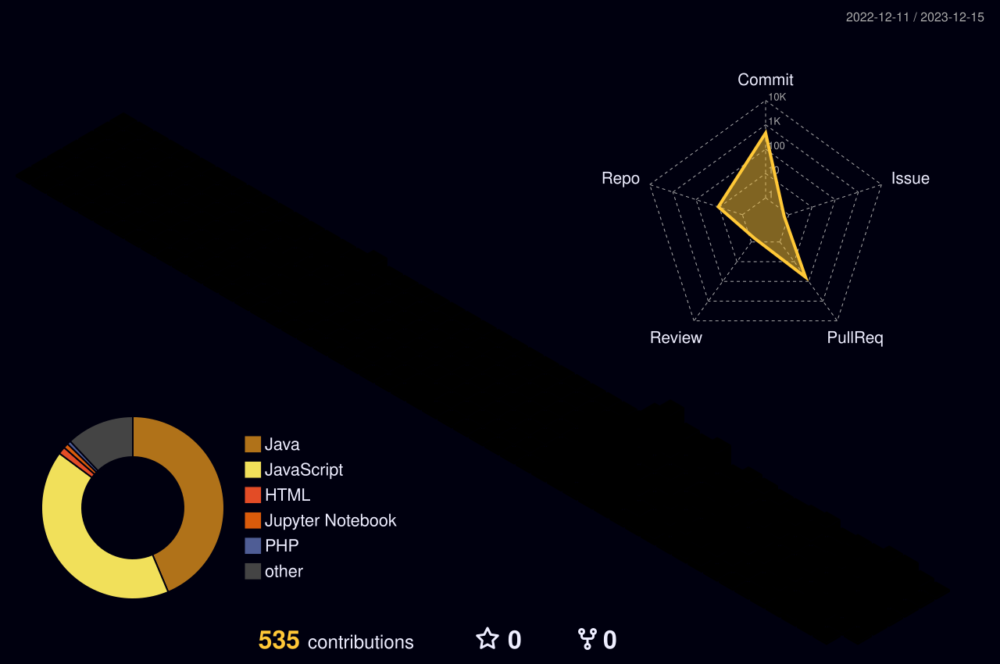

    

####  :wave: Welcome my github profile !

####  :mag_right: Other Site
  
  
  

#### :clipboard: Tech Stack

##### Languages

 

##### Backend

 

##### Frontend

 

##### DevOps / Infra

 

##### Monitoring / Data

 

##### Cloud

 

##### Tools / Collaboration

####  :page_with_curl: Record

  
  

<!--
**YangjiwooGN/YangjiwooGN** is a ✨ _special_ ✨ repository because its `README.md` (this file) appears on your GitHub profile.

Here are some ideas to get you started:

- 🔭 I’m currently working on ...
- 🌱 I’m currently learning ...
- 👯 I’m looking to collaborate on ...
- 🤔 I’m looking for help with ...
- 💬 Ask me about ...
- 📫 How to reach me: ...
- 😄 Pronouns: ...
- ⚡ Fun fact: ...
-->
